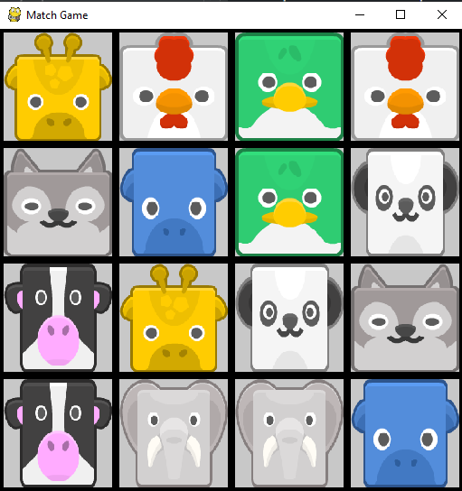
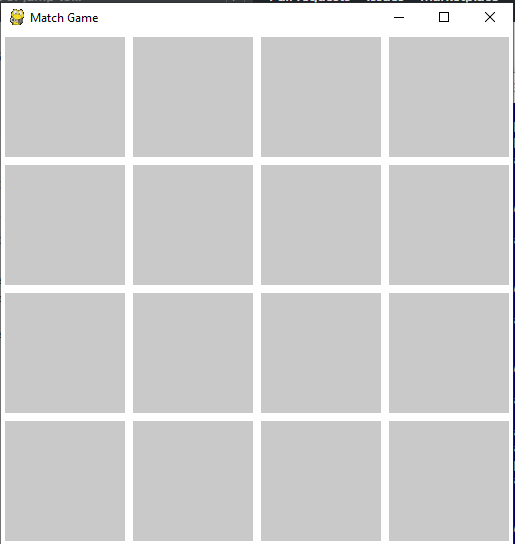
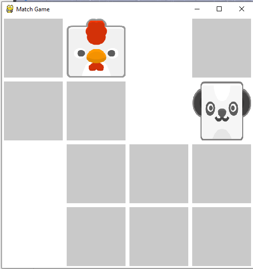
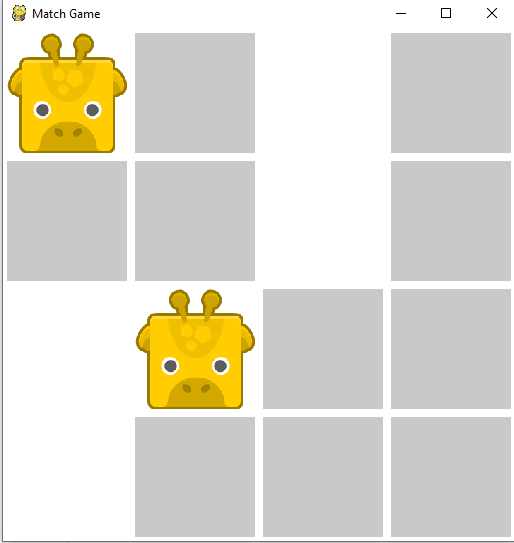
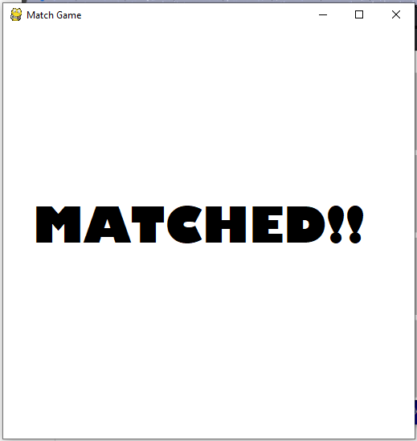
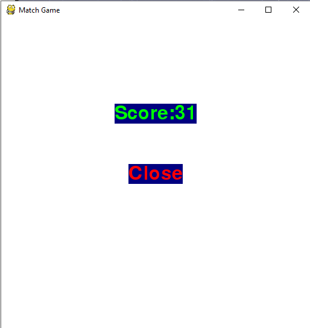

# Flip_match_game
A game developed in python using pygame

## Usage
<code><strong>First clone the directory using command</strong></code>
``` bash
git clone https://github.com/dadayadav/Flip_match_game.git 
```
##### Install all requirements:
``` bash
pip install -r requirements.txt
```

Run <code><strong>app.py</strong></code> file

##### Linux:
``` python
python3 app.py
```
##### Windows:
 - First open python shell or anaconda prompt in working directory. <br>
 - Then run
``` python
python app.py
```

## Results 

### 1. Starting of Game:
<span>This image is for remembering the images</span> 



### 2. Starting of Game:
<span>From here we will start playing the game</span> 



### 3. Unmatched Situation:



### 4. Matching of two tiles:
<span> Here we match two same images</span>
  


### 5. Notificationof matching tiles:



### 6. Final Score:
<span> Here the Final <code><strong> score </strong></code> represent the total no of <code><strong> steps/clicks </strong></code>are taken to complete the game</span>
<br>  <strong><code>:-> Less score give better performance </code></strong>
  



